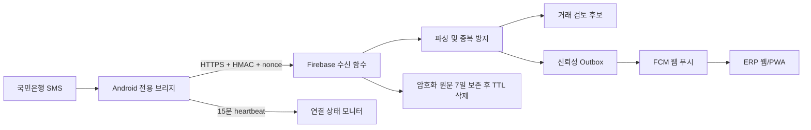

# 국민은행 SMS → 웹·앱 알림 운영 가이드

이 기능은 회사 전용 Android 휴대폰에 도착한 국민은행 입출금 SMS를 허용 발신자만 선별해 서명 전송하고, 서버에서 검증·파싱한 뒤 ERP 웹/PWA와 브라우저 푸시로 알립니다. SMS는 자동 회계 확정 자료가 아니라 **검토 후보**로 취급합니다.

## 전체 흐름



## 1단계 — 운영 기준 확정

1. SMS를 받을 **회사 소유 Android 휴대폰 1대**를 정합니다. 개인 휴대폰은 사용하지 않는 것을 권장합니다.
2. 알림을 받을 ERP 사용자를 정합니다. `admin`, `finance`, `payroll`, `audit` 권한은 화면을 볼 수 있고, 거래 확정/제외는 `admin`, `finance`, `payroll`, 전체 설정 및 재분석은 `admin`만 가능합니다.
3. 휴대폰의 실제 문자 상세에서 국민은행 발신번호 또는 발신자명을 확인합니다. 부분 일치와 와일드카드는 허용되지 않습니다.
4. 운영 수락 기준을 정합니다.
   - 같은 문자가 재전송돼도 후보와 ERP 메시지는 1건만 생성
   - 허용하지 않은 발신자, 잘못된 서명, 오래된 요청, 재사용 nonce는 거부
   - 원문·계좌·잔액·비밀키는 로그에 남기지 않음
   - 파싱 실패는 폐기하지 않고 관리자 검토함에 보관

## 2단계 — Firebase 서버 설정 및 배포

### 2-1. 기기 비밀키 만들기

PowerShell에서 기기마다 새로운 비밀키를 만듭니다.

```powershell
$bytes = New-Object byte[] 48
[Security.Cryptography.RandomNumberGenerator]::Fill($bytes)
$deviceSecret = [Convert]::ToBase64String($bytes)
$deviceSecret
```

Android 앱을 먼저 한 번 열어 화면의 기기 UUID를 확인한 뒤, 다음과 같은 **전체 기기 맵 JSON**을 준비합니다. 기존 기기가 있으면 반드시 함께 넣습니다.

```json
{
  "Android 앱에 표시된 기기 UUID": "위에서 생성한 비밀키"
}
```

Firebase CLI가 로그인돼 있고 대상 프로젝트가 선택된 저장소 루트에서 설정합니다. 명령이 값을 요구하면 JSON만 붙여 넣습니다.

```powershell
firebase use <Firebase 프로젝트 ID>
firebase functions:secrets:set BANK_SMS_DEVICE_SECRETS
```

### 2-2. 필수 원문 암호화 키 만들기

재분석을 위해 SMS 원문을 최대 7일간 암호화 보관하는 별도의 AES-256 키를 설정합니다. `ingestBankSms`와 `reprocessBankSmsCandidate`가 이 Secret을 배포 시 바인딩하므로 운영 배포 전 반드시 한 버전 이상을 만들어야 합니다.

```powershell
$bytes = New-Object byte[] 32
[Security.Cryptography.RandomNumberGenerator]::Fill($bytes)
$aesKey = [Convert]::ToBase64String($bytes)
$aesKey
firebase functions:secrets:set BANK_SMS_ENCRYPTION_KEY
```

실제 키는 저장소의 `.env`나 문서에 기록하지 않습니다.

키를 교체할 때는 최근 7일 자료를 재분석할 수 있도록 기존 키와 새 키를 겹쳐 둡니다. `BANK_SMS_ENCRYPTION_KEY` Secret 값을 아래 JSON 형태로 바꾸고, `BANK_SMS_ENCRYPTION_KEY_ID`를 `v2`로 배포합니다. 7일 보존 기간과 TTL 삭제 여유가 지난 뒤에만 `v1`을 제거합니다.

```json
{"v1":"기존 32바이트 키의 base64","v2":"새 32바이트 키의 base64"}
```

### 2-3. 비밀이 아닌 운영값 설정

`functions/.env.<Firebase 프로젝트 ID>` 파일을 로컬에 만들고 다음 값만 환경에 맞게 설정합니다. 이 파일은 커밋하지 않습니다.

```dotenv
BANK_SMS_ALLOWED_SENDERS=15889999
BANK_HMAC_MAX_SKEW_SECONDS=300
BANK_NOTIFICATION_APP_URL=https://<프로젝트>.web.app
BANK_SMS_ENCRYPTION_KEY_ID=v1
BANK_SMS_RETENTION_DAYS=7
BANK_BRIDGE_STALE_MINUTES=120
BANK_PUSH_DEVICE_MAX_AGE_DAYS=90
BANK_PUSH_MAX_ATTEMPTS=5
BANK_PUSH_MAX_EVENT_AGE_MINUTES=15
```

`BANK_SMS_ALLOWED_SENDERS`에는 휴대폰에서 확인한 실제 값을 쉼표로 구분해 입력합니다. 앱의 허용 목록에도 동일한 값을 입력해야 합니다.

### 2-4. 서버·보안 규칙 배포

먼저 로컬 검증을 실행합니다.

```powershell
npm run test:bank-rules
cd functions
npm run test:bank-notifications
npm run build
cd ..
```

검증 후 운영 프로젝트에 배포합니다.

```powershell
firebase deploy --only "functions:ingestBankSms,functions:monitorBankNotificationHealth,functions:processBankNotificationOutbox,functions:reprocessBankSmsCandidate"
firebase deploy --only firestore:rules,firestore:indexes
```

Firestore 인덱스 배포에는 `bank_sms_ingestions`, `bank_ingestion_replay_nonces`, `bank_notification_outbox`의 `retentionExpiresAt` TTL 정책이 포함됩니다. 만료 시각 직후 즉시 지워지는 방식은 아니므로 운영 점검에서는 여유를 둡니다.

## 3단계 — Android 브리지 설치 및 연결

1. 테스트용 APK는 `android-sms-bridge/app/build/outputs/apk/debug/app-debug.apk`입니다. 운영에는 회사 키로 서명한 release APK 또는 MDM 배포를 사용합니다.
2. USB 디버깅 테스트 설치:

   ```powershell
   adb install -r android-sms-bridge/app/build/outputs/apk/debug/app-debug.apk
   ```

3. 앱을 열고 **문자 수신 권한**을 허용합니다.
4. 앱에 다음을 입력합니다.
   - 서버 주소: `https://asia-northeast3-<Firebase 프로젝트 ID>.cloudfunctions.net/ingestBankSms`
   - 허용 발신자: 2단계 서버 설정과 동일한 실제 값
   - 비밀키: `BANK_SMS_DEVICE_SECRETS`에서 이 기기 UUID에 대응하는 값
5. **설정 저장 → 서버 연결 테스트**를 누릅니다.
6. `연결 테스트 성공`, 대기 `0개`를 확인합니다.
7. Android 앱 정보에서 배터리 사용을 **제한 없음**으로 설정하고, 충전 및 데이터 연결을 유지합니다.

기기 UUID와 비밀키가 서버 JSON에서 한 쌍으로 일치해야 합니다. 휴대폰을 교체하면 새 UUID와 새 키를 만들고 기존 UUID를 Secret Manager JSON에서 제거한 뒤 함수를 다시 배포합니다.

## 4단계 — 웹/PWA 푸시 활성화

1. Firebase Console의 **프로젝트 설정 → 클라우드 메시징 → 웹 푸시 인증서**에서 VAPID 공개 키를 생성하거나 확인합니다.
2. 웹 빌드 환경에 공개 키를 설정합니다. 공개 키만 사용하며 비공개 키는 프런트엔드에 넣지 않습니다.

   ```dotenv
   REACT_APP_FIREBASE_VAPID_KEY=<VAPID 공개 키>
   ```

3. 웹을 빌드하고 배포합니다.

   ```powershell
   npm run build
   firebase deploy --only hosting
   ```

4. ERP에 로그인해 **세무 관리/세금관리 → 국민은행 알림** 또는 `/finance/bank-notifications`로 이동합니다.
5. **이 기기에서 알림 받기**를 누르고 브라우저 알림 권한을 허용합니다.
6. 관리자는 같은 화면의 설정에서 알림 수신자, 입금/출금 방향, 최소 금액, 파싱 실패 알림, 방해 금지 시간을 저장합니다.

푸시는 HTTPS 배포 주소에서 사용해야 합니다. 로그아웃하면 현재 브라우저의 서버 등록과 로컬 푸시 구독을 함께 해제하며, 90일간 갱신되지 않은 등록은 서버가 자동 제외합니다.

## 5단계 — 입금·출금 종단 테스트

운영 전에는 실제 휴대폰과 운영과 같은 네트워크로 다음 순서대로 확인합니다.

1. 국민은행 계좌에 소액 입금 1회, 소액 출금 1회를 수행합니다.
2. Android에서 마지막 수신/전송 성공 시각과 대기 `0개`를 확인합니다.
3. 웹의 **국민은행 알림** 화면에서 금액, 입출금 구분, 거래 시각, 마스킹된 계좌/상대 정보를 원문 및 은행 원장과 대조합니다.
4. 같은 SMS가 다시 처리돼도 후보·ERP 메시지가 늘지 않는지 확인합니다.
5. 수신자로 지정된 로그인 사용자에게만 ERP 알림과 브라우저 푸시가 오는지 확인합니다.
6. 화면이 열려 있으면 상단 실시간 알림이, 화면이 닫혀 있거나 백그라운드이면 운영체제 알림이 표시되는지 확인합니다.
7. 후보에서 **확정** 또는 **제외**를 실행하고 감사자 정보와 시간이 기록되는지 확인합니다.
8. 테스트 결과를 은행 원장과 맞춘 후에만 상시 운영으로 전환합니다.

파싱 실패 건은 관리자가 상세 화면의 **문자 재분석**을 실행할 수 있습니다. AES 키와 암호화 원문이 남아 있고 새 파서가 성공한 경우에만 후보가 복구됩니다.

## 6단계 — 모니터링, 장애 복구, 보안 운영

- Android는 약 15분마다 서명 heartbeat를 전송합니다. 절전 모드 지연을 감안해 2시간 이상 신호가 없을 때 웹에서 연결 지연으로 표시합니다.
- 전송 실패 SMS는 Android 앱 전용 저장소에 암호화 대기하며, 네트워크 복구 후 자동 재시도합니다. 필요하면 **대기 중인 항목 다시 보내기**를 누릅니다.
- 푸시는 거래 저장과 같은 트랜잭션에서 Outbox에 기록됩니다. 일시적인 FCM 장애만 제한 횟수 재시도하며, 15분이 지난 알림은 새 알림처럼 늦게 보내지 않고 `dead_letter/expired`로 종료합니다.
- `bank_notification_health/current`에서 마지막 heartbeat/수신, 파서 결과, 연결 상태를 확인합니다.
- `bank_notification_outbox`의 `retry`, `dead_letter`를 운영 점검 대상으로 삼고, `deliveryResult`와 `lastErrorCode`로 원인을 확인합니다.
- 잘못되거나 만료된 FCM 토큰은 자동 비활성화합니다. 직원 퇴사·계정 중지 시 Firebase Authentication과 `users` 상태를 모두 비활성화합니다.
- SMS 원문은 AES-256-GCM으로 암호화된 경우에만 `bank_sms_ingestions`에 남고 기본 7일 후 TTL 대상이 됩니다. 후보와 ERP 메시지에는 마스킹/요약값만 보관합니다.
- Secret Manager 키 변경 시 Android 앱의 키도 같은 작업 창에서 바꾸고 연결 테스트를 완료합니다. 키를 로그, 이슈, 메신저, 스크린샷에 남기지 않습니다.

장애 점검 순서:

1. Android 문자 권한과 실제 SMS 도착 여부
2. 앱 허용 발신자와 서버 `BANK_SMS_ALLOWED_SENDERS` 일치 여부
3. 기기 UUID와 Secret Manager JSON 키 일치 여부
4. 휴대폰 네트워크, 배터리 제한, 대기 건수
5. 웹 연결 상태와 `bank_notification_health/current`
6. Functions 오류 코드와 Outbox 상태(원문 또는 비밀키가 로그에 없는지 함께 확인)

## 7단계 — 공식 은행 연동으로 전환

`ingestBankProviderWebhook`은 향후 공식 은행/중계 사업자 이벤트를 같은 후보·알림 흐름으로 넣기 위한 HMAC 어댑터입니다. 현재 코드는 특정 국민은행 기업 API 계약을 대신하지 않으며, 실제 사용 전에는 다음이 필요합니다.

1. 국민은행 또는 승인된 중계 사업자와 기업용 입출금 통지 API 계약
2. 공식 이벤트 필드, 서명 규격, IP/인증서, 재전송 정책 확인
3. 제공자별 비밀키를 `BANK_PROVIDER_WEBHOOK_SECRETS`에 등록. 인증 헤더의 제공자 ID가 서버의 제공자 식별자가 되며 모든 이벤트에 안정적인 `eventId`가 필수
4. 샌드박스의 입금·출금·중복·순서 역전·장애 재전송 시험
5. SMS와 공식 이벤트가 동시에 들어올 때의 교차 중복 키 설계 및 원장 대조
6. 공식 채널 안정화 후 Android SMS를 보조 경보 채널로 전환

공식 제공자 함수를 처음 배포하기 전에는 32바이트 이상의 무작위 키로 전체 제공자 맵을 Secret Manager에 먼저 등록합니다.

```powershell
firebase functions:secrets:set BANK_PROVIDER_WEBHOOK_SECRETS
# 입력 예: {"kb-contracted-client":"32바이트 이상의 무작위 비밀키"}
firebase deploy --only functions:ingestBankProviderWebhook
```

공식 계약과 자격 증명이 없는 상태에서는 이 어댑터를 운영 국민은행 API로 간주하면 안 됩니다.

## 구현·검증 명령 요약

```powershell
# 웹/공통 테스트
npm run typecheck
npm test -- --watchAll=false --runTestsByPath `
  src/features/bank-notifications/bankNotificationUtils.test.ts `
  src/features/bank-notifications/bankNotificationPermissions.test.ts `
  src/security/firebaseRules.test.ts `
  src/utils/accessRoles.test.ts
npm run test:bank-rules
npm run build

# 서버
cd functions
npm run test:bank-notifications
npm run build
cd ..

# Android
$env:JAVA_HOME='C:\Program Files\Android\Android Studio\jbr'
$env:ANDROID_HOME="$env:LOCALAPPDATA\Android\Sdk"
cd android-sms-bridge
.\gradlew.bat testDebugUnitTest lintDebug assembleDebug
```

자동 테스트는 파서/HMAC/중복 키/권한/Firestore 규칙/프런트엔드 로직/Android 빌드까지 검증합니다. 실제 SMS 브로드캐스트, Android 절전 모드, 운영 FCM, 국민은행 원장 일치는 반드시 실제 기기에서 위 5단계로 최종 검증해야 합니다.
